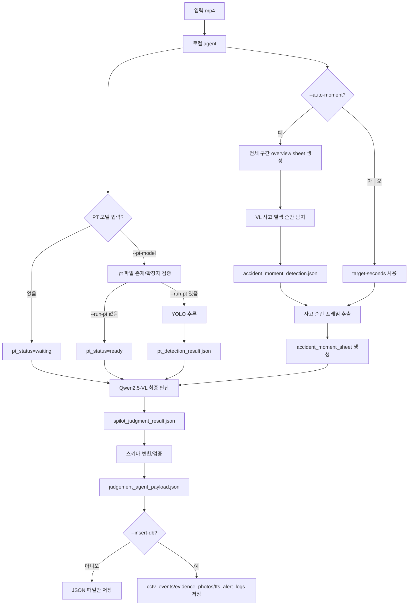
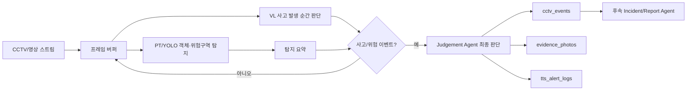
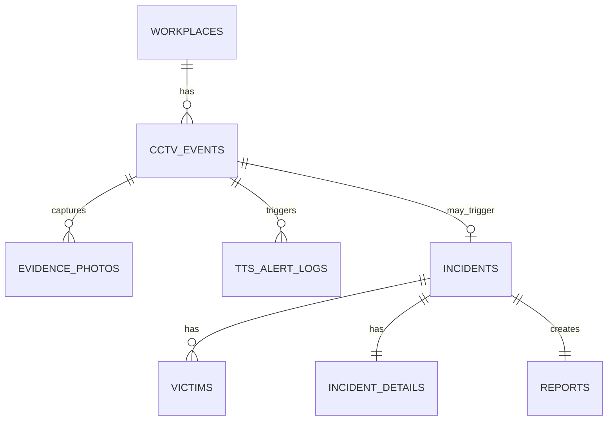

# Judgement AI Agent

SPilot 판단 AI Agent 로컬 실행 폴더입니다.

현재 구조는 Colab에는 Qwen2.5-VL 서버만 띄우고, 로컬에서는 mp4 처리, VL 요청, JSON 검증, 스키마 저장을 담당합니다.

## 전체 흐름



## 판단 방식

현재 Qwen2.5-VL은 원본 mp4 전체를 직접 스트리밍으로 보는 방식이 아닙니다. 로컬 agent가 mp4에서 프레임 contact sheet를 만들고, Qwen2.5-VL은 이 이미지를 보고 사고 발생 순간과 사고 유형/경위를 판단합니다.

비디오 테스트에서는 두 단계 VL 판단이 가능합니다.

1. `--auto-moment`: 전체 영상 overview sheet를 보고 사고 발생 시점 후보를 찾습니다.
2. 최종 판단: 사고 순간 전후 contact sheet를 보고 사고 유형, 작업자 변화, 구조물 상태, `details`를 생성합니다.

PT 모델은 두 단계로 연결됩니다.

1. `--pt-model`만 주면 `.pt` 파일이 존재하는지 확인하고 `pt_status=ready`로 저장합니다.
2. `--pt-model`과 `--run-pt`를 같이 주면 YOLO 추론을 실행하고, 탐지 라벨/box/confidence를 `pt_detection_result.json`에 저장합니다.

`--run-pt`로 생성된 PT 탐지 결과는 Qwen 프롬프트의 `[PT 탐지 보조 정보]`에 함께 들어갑니다. 즉 최종 판단은 `VL 사고 순간 탐지 + contact sheet 이미지 + PT 탐지 요약`을 같이 보고 Qwen2.5-VL이 생성합니다.

최종 목표는 아래 구조입니다.



현재는 스트림 대신 mp4 파일로 같은 구조를 테스트하는 단계입니다.

## ERD 기준 저장 범위

`spilot_erd_v5.html` 기준으로 현재 Judgement Agent가 직접 생성하는 영역은 영상 분석 파트입니다.



현재 코드가 직접 저장하는 테이블:

- `cctv_events`: 사고/위험 이벤트 1차 감지 결과, agent 판정, 요약, clip/snapshot 경로
- `evidence_photos`: CCTV contact sheet 또는 스냅샷 증거 이미지
- `tts_alert_logs`: 위험 이벤트 발생 시 방송/알림 로그

## 출력 변수와 ERD 매핑

`judgement_agent_payload.json`의 `video_part_tables`는 아래 ERD 컬럼에 맞춰 생성됩니다.

### cctv_events

| payload key | ERD column | 설명 |
|---|---|---|
| `camera_id` | `cctv_events.camera_id` | 카메라 ID |
| `zone_id` | `cctv_events.zone_id` | 감시구역 ID |
| `detected_at` | `cctv_events.detected_at` | 감지일시 |
| `label` | `cctv_events.label` | `worker_fall_from_height`, `worker_slip_and_fall`, `fire_or_smoke` 등 |
| `confidence` | `cctv_events.confidence` | Qwen/VL 판단 신뢰도 |
| `clip_path` | `cctv_events.clip_path` | 원본 또는 클립 영상 경로 |
| `clip_start_offset` | `cctv_events.clip_start_offset` | 사고 순간 전후 클립 시작 초 |
| `clip_end_offset` | `cctv_events.clip_end_offset` | 사고 순간 전후 클립 종료 초 |
| `agent_verdict` | `cctv_events.agent_verdict` | `accident`, `near_miss`, `normal` |
| `agent_summary` | `cctv_events.agent_summary` | LLM이 생성한 사고 경위 `details` |
| `is_incident_trigger` | `cctv_events.is_incident_trigger` | 사고 생성 트리거 여부 |
| `bbox_json` | `cctv_events.bbox_json` | PT/YOLO bbox JSON, 현재 미탐지 시 `[]` |
| `snapshot_path` | `cctv_events.snapshot_path` | contact sheet 또는 대표 스냅샷 경로 |
| `is_simulated` | `cctv_events.is_simulated` | 현재 mp4 테스트는 `true` |

### evidence_photos

| payload key | ERD column | 설명 |
|---|---|---|
| `event_id` | `evidence_photos.event_id` | 연결할 CCTV 이벤트 |
| `incident_id` | `evidence_photos.incident_id` | 사고 확정 전에는 `null` |
| `photo_url` | `evidence_photos.photo_url` | 증거 이미지 경로 |
| `detected_label` | `evidence_photos.detected_label` | 이벤트 라벨 |
| `confidence` | `evidence_photos.confidence` | 판단/탐지 신뢰도 |
| `taken_at` | `evidence_photos.taken_at` | 캡처 시각 |
| `source_type` | `evidence_photos.source_type` | 현재 `cctv_capture` |
| `is_representative` | `evidence_photos.is_representative` | 대표 이미지 여부 |

### tts_alert_logs

| payload key | ERD column | 설명 |
|---|---|---|
| `event_id` | `tts_alert_logs.event_id` | 연결할 CCTV 이벤트 |
| `camera_id` | `tts_alert_logs.camera_id` | 발생 카메라 |
| `zone_id` | `tts_alert_logs.zone_id` | 감시구역 |
| `language` | `tts_alert_logs.language` | 현재 `ko` |
| `message` | `tts_alert_logs.message` | 방송 문구 |
| `play_order` | `tts_alert_logs.play_order` | 재생 순서 |
| `audio_url` | `tts_alert_logs.audio_url` | 음성 파일 경로, 현재 `null` |
| `played_at` | `tts_alert_logs.played_at` | 재생 시각 |
| `status` | `tts_alert_logs.status` | `success`, `failed`, `skipped` |

아직 직접 생성하지 않는 테이블:

- `incidents`
- `victims`
- `incident_details`
- `reports`

이 테이블들은 다음 단계에서 사고 확정/보고서 Agent가 이어받아 생성하는 영역입니다. 현재 `judgement_agent_payload.json`에는 Qwen 판단 원문, 사고 유형, 상세 경위, 영상 파트 테이블 payload, PT 상태가 모두 들어가므로 이후 `incidents`와 `reports` 생성 Agent가 이 JSON을 입력으로 사용할 수 있습니다.

정리하면 LLM이 ERD 전체를 직접 DB row로 “전부 생성”하는 구조는 아닙니다. LLM은 사고 판단 JSON을 만들고, 로컬 mapper인 `save_judgment.py`가 ERD에 맞는 `cctv_events`, `evidence_photos`, `tts_alert_logs` payload로 변환합니다.

## 주요 파일

- `run_remote_judgment.py`: mp4에서 사고 순간 contact sheet를 만들고 Colab Qwen 서버에 요청한 뒤 JSON 저장
- `save_judgment.py`: Qwen 결과 JSON을 SPilot 저장 스키마로 변환하고 선택적으로 DB 저장
- `pt_detector.py`: YOLO `.pt` 모델 입력/추론 결과를 agent payload에 연결
- `test_json_payload.py`: 생성된 JSON 파일만 검증하는 테스트 스크립트
- `schemas.py`: 판단 결과와 영상 파트 테이블 payload 타입
- `env.py`: `agent/.env` 로더

## 실행

먼저 `backend` 가상환경을 활성화합니다.

```powershell
cd C:\spilot\backend
.\.venv\Scripts\activate.ps1
```

`agent\.env`에 Colab/ngrok 주소를 넣습니다.

```env
LLM_API_BASE=https://xxxxx.ngrok-free.app/v1
```

영상 판단과 JSON 저장:

```powershell
python -m agent.run_remote_judgment --video C:\spilot\backend\agent\video\accident_video.mp4
```

VL이 사고 발생 순간도 먼저 찾게 하려면:

```powershell
python -m agent.run_remote_judgment --video C:\spilot\backend\agent\video\accident_video.mp4 --auto-moment
```

PT 모델 파일은 공지 기준대로 `backend\model`에 넣고 경로를 넘깁니다.

```text
C:\spilot\backend\model\best.pt
```

PT 파일 입력 확인만 포함:

```powershell
python -m agent.run_remote_judgment --video C:\spilot\backend\agent\video\accident_video.mp4 --pt-model C:\spilot\backend\model\best.pt
```

PT 추론까지 실행:

```powershell
python -m agent.run_remote_judgment --video C:\spilot\backend\agent\video\accident_video.mp4 --pt-model C:\spilot\backend\model\best.pt --run-pt
```

이 명령은 다음 순서로 동작합니다.

1. `best.pt`로 mp4를 YOLO 추론합니다.
2. 탐지 결과를 `agent/output/pt_detection_result.json`에 저장합니다.
3. `--auto-moment`가 있으면 VL이 사고 발생 시점을 먼저 찾습니다.
4. 사고 순간 contact sheet를 생성합니다.
5. Qwen2.5-VL에 contact sheet, 사고 순간 탐지 결과, PT 탐지 요약을 함께 보냅니다.
6. Qwen 판단 결과를 raw JSON으로 저장합니다.
7. SPilot ERD의 영상 파트 테이블 payload로 변환합니다.

DB까지 저장:

```powershell
python -m agent.run_remote_judgment --video C:\spilot\backend\agent\video\accident_video.mp4 --insert-db
```

## JSON 테스트

최근 생성된 JSON 파일을 검증합니다.

```powershell
python -m agent.test_json_payload
```

직접 파일을 지정할 수도 있습니다.

```powershell
python -m agent.test_json_payload --raw agent/output/spilot_judgment_result.json --payload agent/output/judgement_agent_payload.json
```

테스트 대상:

- raw Qwen 결과: `agent/output/spilot_judgment_result.json`
- SPilot 저장 payload: `agent/output/judgement_agent_payload.json`
- PT 결과: `agent/output/pt_detection_result.json`

## 출력 파일

```text
C:\spilot\backend\agent\output\accident_moment_sheet.jpg
C:\spilot\backend\agent\output\accident_overview_sheet.jpg
C:\spilot\backend\agent\output\accident_moment_detection.json
C:\spilot\backend\agent\output\spilot_judgment_result.json
C:\spilot\backend\agent\output\pt_detection_result.json
C:\spilot\backend\agent\output\judgement_agent_payload.json
```
